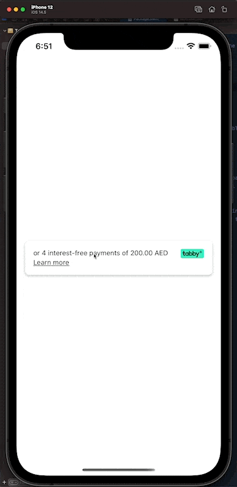

# Tabby

## Requirements

iOS 13.0+
Swift 5.3+
Xcode 12.0+

## Integration

### Swift Package Manager (recommended)

```
dependencies: [
    .package(url: "https://github.com/tabby-ai/tabby-ios-sdk.git", .upToNextMajor(from: "0.0.1"))
]

```

```swift
import UIKit
import SwiftUI
import Tabby

class ViewController: UIViewController {

    override func viewDidLoad() {
        super.viewDidLoad()
        if #available(iOS 13.0, *) {
            let vc = UIHostingController(
                rootView: Tabby.TabbyPresentationSnippet(
                    amount: 800,
                    currency: .AED,
                    lang: Lang.en)
            )
            addChild(vc)
            vc.view.frame = view.frame
            view.addSubview(vc.view)
            vc.didMove(toParent: self)
        } else {
            // Fallback on earlier versions
        }
    }
}
```


## Result




## SDK usage

### 1.  Init Tabby when your app starts (AppDelegete or @main)
`TabbySDK.shared.setup(withApiKey: "__API_KEY_HERE__")`

### 2.  Prepare view
```swift
import Tabby

let customerPayment = Payment(
    amount: "340",
    currency: .AED,
    buyer: Buyer(
        email: "successful.payment@tabby.ai",
        phone: "500000001",
        name: "Yazan Khalid"
    )
)

let myTestPayment = TabbyCheckoutPayload(merchant_code: "ae", lang: .en, payment: customerPayment)

...
in your CartScreenView etc in .onAppear or viewDidLoad 
...
.onAppear() {
    TabbySDK.shared.configure(forPayment: myTestPayment) { result in
        switch result {
        case .success(let s):
            // 1. Do something sith sessionId (this step is optional)
            print("sessionid: \(s.sessionId)")
            // 2. Grab avaibable products from session and enable proper
            // payment method buttons in your UI (this step is required)
            print("tabby available products: \(s.tabbyProductTypes)")
            if (s.tabbyProductTypes.contains(.installments)) {
                self.isTabbyInstallmentsAvailable = true
            }
            if (s.tabbyProductTypes.contains(.pay_later)) {
                self.isTabbyPaylatersAvailable = true
            }
        case .failure(let error):
            // Do something when Tabby checkout session POST requiest failed
            print(error)
        }
    }
}
```

### 3. Launch Tabby checkout

SDK is built for your convineance - one `TabbySDK.shared.configure(forPayment: myTestPayment) { result in ... }`  is called - you can render something like this
if modal / sheet / seguway / NavigationLink / ViewController etc - whatever fits your UI and app structure. With both SwiftUI and UIKit 

```swift
.sheet(isPresented: $isTabbyOpened, content: {
    TabbyCheckout(productType: openedProduct, onResult: { result in
        print("TABBY RESULT: \(result)!!!")
        switch result {
        case .authorized:
            // Do something else when Tabby authorized customer
            self.isTabbyOpened = false
            break
        case .rejected:
            // Do something else when Tabby rejected customer
            self.isTabbyOpened = false
            break
        case .close:
            // Do something else when customer closed Tabby checkout
            self.isTabbyOpened = false
            break
        }
    })
})
```

### Full example code goes here

```swift

struct CheckoutExampleWithTabby: View {
    @State var isTabbyInstallmentsAvailable = false
    @State var isTabbyPaylatersAvailable = false
    
    @State var openedProduct: TabbyProductType = .installments
    @State var isTabbyOpened: Bool = false
    
    var body: some View {
        VStack {
            Button(action: {
                openedProduct = .installments
                isTabbyOpened = true
            }, label: {
                HStack {
                    Text("Your Tabby Installments Button")
                        .font(.headline)
                        .foregroundColor(isTabbyInstallmentsAvailable ? .black : .white)
                }
            })
            .disabled(!isTabbyInstallmentsAvailable)
            
            Button(action: {
                openedProduct = .pay_later
                isTabbyOpened = true
            }, label: {
                HStack {
                    Text("Your Tabby PayLater Button")
                        .font(.headline)
                        .foregroundColor(isTabbyPaylatersAvailable ? .black : .white)
                }
            })
            .disabled(!isTabbyPaylatersAvailable)
            
        }
        .sheet(isPresented: $isTabbyOpened, content: {
            TabbyCheckout(productType: openedProduct, onResult: { result in
                print("TABBY RESULT: \(result)!!!")
                switch result {
                case .authorized:
                    // Do something else when Tabby authorized customer
                    self.isTabbyOpened = false
                    break
                case .rejected:
                    // Do something else when Tabby rejected customer
                    self.isTabbyOpened = false
                    break
                case .close:
                    // Do something else when customer closed Tabby checkout
                    self.isTabbyOpened = false
                    break
                }
            })
        })
        .onAppear() {
            TabbySDK.shared.configure(forPayment: myTestPayment) { result in
                switch result {
                case .success(let s):
                    // 1. Do something sith sessionId (this step is optional)
                    print("sessionid: \(s.sessionId)")
                    // 2. Grab avaibable products from session and enable proper
                    // payment method buttons in your UI (this step is required)
                    print("tabby available products: \(s.tabbyProductTypes)")
                    if (s.tabbyProductTypes.contains(.installments)) {
                        self.isTabbyInstallmentsAvailable = true
                    }
                    if (s.tabbyProductTypes.contains(.pay_later)) {
                        self.isTabbyPaylatersAvailable = true
                    }
                case .failure(let error):
                    // Do something when Tabby checkout session POST requiest failed
                    print(error)
                }
            }
        }
    }
}
```
